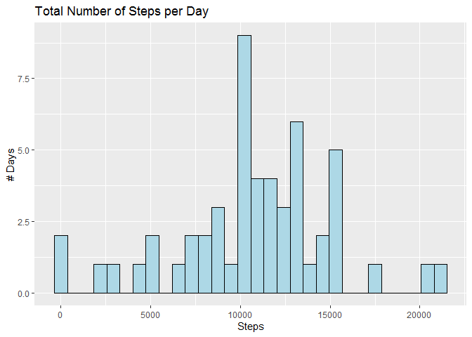
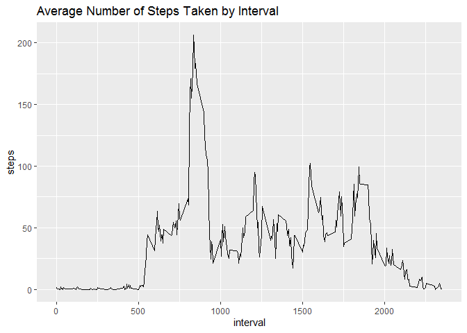
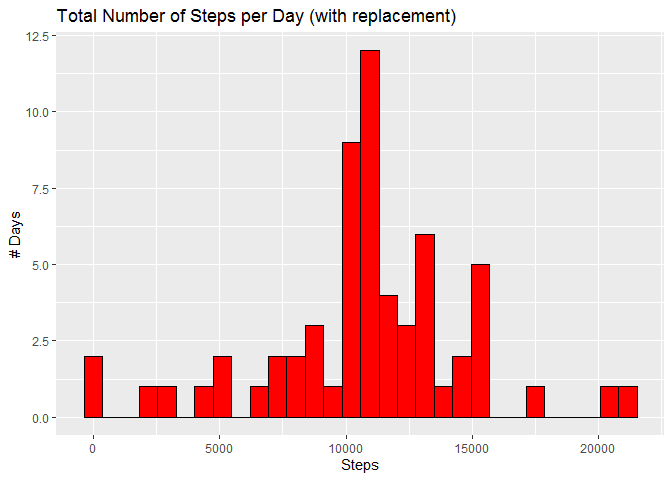
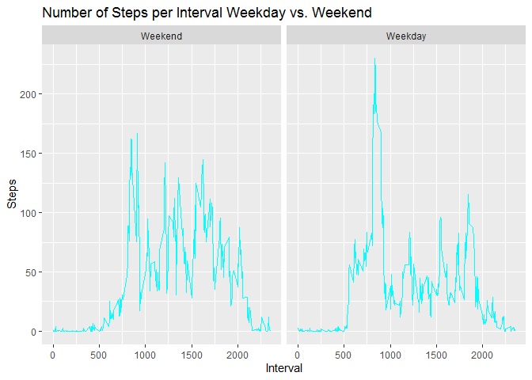

## Loading and preprocessing the data

```r
library(dplyr)
library(ggplot2)
##unzip("activity.zip")
activity <- read.csv("activity.csv", colClasses = c("integer","Date","integer"))
```

## What is mean total number of steps taken per day?

```r
##Group by date and summarize the days using the SUM function, then plot in histogram
a <- activity %>% group_by(date) %>% summarize(steps=sum(steps), na.rm = TRUE)
ggplot(a, aes(x=steps))+
      geom_histogram(color="black", fill="lightblue")+
      ggtitle("Total Number of Steps per Day")+
      xlab("Steps")+
      ylab("# Days")
```

<!-- -->


```r
##Print the mean/median steps by day (using the 'a' data frame)
z <- mean(a$steps, na.rm=T)
cat("Mean: ",format(z, big.mark=","))  
```

Mean:  10,766.19

```r
y <- median(a$steps, na.rm=T)
cat("Median: ",format(y, big.mark=","))
```

Median:  10,765

## What is the average daily activity pattern?

```r
##'b' shows the average steps by interval for all days. This will be used later on.
b <- activity %>% group_by(interval) %>% summarize(steps=mean(steps, na.rm=TRUE))
ggplot(b, aes(x=interval, y=steps))+
      geom_line()+
      ggtitle("Average Number of Steps Taken by Interval")
```

<!-- -->


```r
##Find which interval across all days has the maximum number of steps.
maxinterval <- b[which.max(b$steps),]
xmi <- maxinterval[[1]]
cat("Max Interval (x-axis value): ",xmi)
```

Max Interval (x-axis value):  835

## Imputing missing values

```r
##Count number of rows containing missing (NA) step values
na <- sum(is.na(activity$steps))
cat("Total number of missing values in the dataset: ",na)
```

Total number of missing values in the dataset:  2304

###Replace Missing Values with the Average for that interval

```r
##B is average steps per interval to merge with the original 'Activity' table
c <- data.frame(b)
addmean <- merge(activity, c, by.x="interval", by.y="interval")
##Now that the table are merged, need an if statement to replace the NA values with the mean of that interval.
replace_steps <- addmean %>% mutate(replace_steps = ifelse(is.na(steps.x),steps.y,steps.x))
replace_steps_group <- replace_steps %>% group_by(date) %>% summarize(replace_steps=sum(replace_steps, na.rm=TRUE))
ggplot(replace_steps_group, aes(x=replace_steps))+
      geom_histogram(color="black", fill="red")+
      ggtitle("Total Number of Steps per Day (with replacement)")+
      xlab("Steps")+
      ylab("# Days")
```

<!-- -->


```r
##Calculate and print mean/median
z2 <- mean(replace_steps_group$replace_steps, na.rm=T)
cat("Mean: ",format(z2, big.mark=","))  
```

Mean:  10,766.19

```r
y2 <- median(replace_steps_group$replace_steps, na.rm=T)
cat("Median: ",format(y2, big.mark=","))
```

Median:  10,766.19
\
The mean and median are now the same value.


## Are there differences in activity patterns between weekdays and weekends?

```r
##Mutate the replace_steps table to include a factor variable for weekday vs. weekend
replace_steps_wkday <- replace_steps %>% mutate(weekday=weekdays(as.Date(date)), weekday_factor=factor(weekday %in% c("Saturday","Sunday"), levels=c(TRUE,FALSE), labels=c("Weekend","Weekday")))
##Average the number of steps per interval over weekday/weekend
wkday_average <- replace_steps_wkday %>% group_by(interval, weekday_factor) %>% summarize(steps=mean(replace_steps))
##Graph the a time series plot with weekday/weekend factor variable in different panels
ggplot(data=wkday_average, aes(x=interval,y=steps))+
      geom_line(col="cyan")+
      facet_wrap(~weekday_factor)+
      ggtitle("Number of Steps per Interval Weekday vs. Weekend")+
      xlab("Interval")+
      ylab("Steps")
```

<!-- -->

